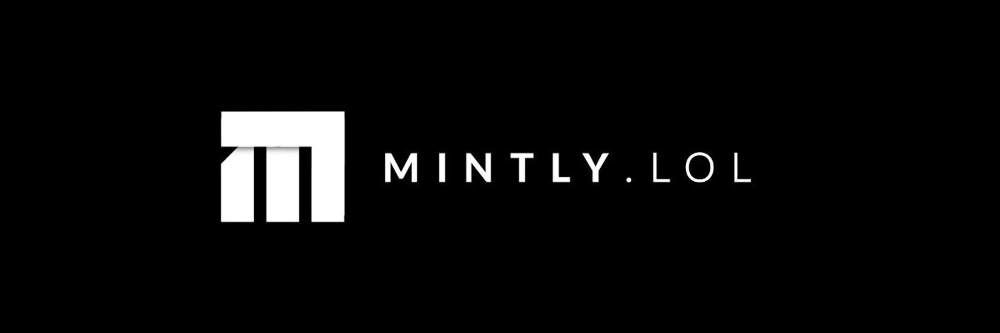

# **OmniMinter v1**

Live at: [https://omnichain-minter.vercel.app/](https://omnichain-minter.vercel.app/)

**OmniMinter v1** is a multi-chain NFT and token minting platform designed to operate across 31 mainnet blockchain ecosystems. This version includes **LayerZero V1 contracts**, featuring **OFT (Omnichain Fungible Tokens)**, **ONFT (Omnichain Non-Fungible Tokens)**, gas refuel capabilities, and cross-chain support via **Wormhole** for both **ERC20** and **ERC721** tokens.

## 🌟 **Features**

- **LayerZero V1 Integration**: Support for **LayerZero V1** contracts, allowing seamless cross-chain communication for NFTs and tokens.
  - **Omnichain Fungible Tokens (OFT)**: Mint and transfer ERC20 tokens across multiple chains.
  - **Omnichain Non-Fungible Tokens (ONFT)**: Mint and transfer NFTs (ERC721) across chains, making NFTs interoperable.
- **Cross-Chain Bridging with Wormhole**: Leveraging **Wormhole** to enable decentralized cross-chain bridging for **ERC20** (fungible tokens) and **ERC721** (non-fungible tokens), providing secure asset transfers across multiple chains.
- **Gas Refuel**: Built-in gas refueling capabilities, allowing users to execute transactions on multiple chains without needing native tokens on each chain.
- **Prisma ORM**: Integrated with **Prisma** for database management, ensuring smooth handling of application data.
- **Next.js & TypeScript**: The platform is built using **Next.js** and **TypeScript**, offering a highly scalable, maintainable, and type-safe development experience.
- **RainbowKit & Wagmi**: Used for Ethereum wallet integration and seamless Web3 connectivity, offering users a frictionless experience when connecting their wallets.

## 🔧 **Relevant Technologies**

- **Blockchain & Web3**:

  - **LayerZero V1**: Cross-chain messaging and interoperability for ERC20 and ERC721 tokens.
  - **Wormhole**: Decentralized bridging protocol for ERC20 and ERC721 tokens across multiple chains.
  - **Ethers.js & Viem**: For seamless blockchain interactions and wallet management.
  - **RainbowKit & Wagmi**: Tools for Ethereum wallet integration and Web3 connectivity.

- **Frontend**:

  - **Next.js**: A modern React framework for fast, server-side rendered applications.
  - **TailwindCSS & DaisyUI**: Utility-first CSS framework and components for rapid UI development.
  - **Framer Motion**: For smooth, performant animations to enhance user experience.

- **Forms & State Management**:

  - **React Hook Form**: Simplified form handling.
  - **TanStack React Query**: State management and caching for data synchronization.

- **Dev Tools**:
  - **Webpack Bundle Analyzer**: For build optimization and analysis.

## 📃 **License**

This project is licensed under the [MIT License](LICENSE).
